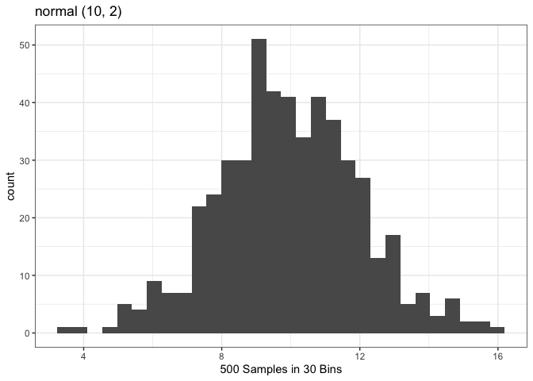

<!-- README.md is generated from README.Rmd. Please edit that file -->

# cp.package

<!-- badges: start -->

<!-- badges: end -->

The goal of cp.package is to …

## Installation

You can install the released version of cp.package from
[CRAN](https://CRAN.R-project.org) with:

``` r
install.packages("cp.package")
```

``` r
library(cp.package)
```

## Random Number Generation

Generate n number of random numbers from a given distribution.
Distribution options include normal, binomial, t, and F.

Example:

``` r
random_gen("normal", 3)
#> [1]  7.379543  9.571505 13.534943
```

## Plot Generator for Random Numbers

Generate histogram plot from n number of random numbers from a given
distribution. Distribution options include normal, binomial, t, and F.

Example:

``` r
random_plot("normal", 500)
```


